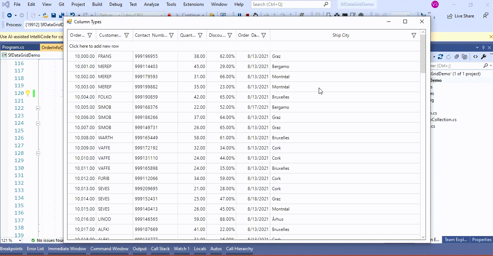

# How to show TextBox and Combobox alternatively in GridComboBoxColumn in WinForms DataGrid (SfDatGrid)?

## About the sample
This example illustrates how to show TextBox and Combobox alternatively in GridComboBoxColumn in [WinForms DataGrid](https://www.syncfusion.com/winforms-ui-controls/datagrid) (SfDatGrid)?

[WinForms DataGrid](https://www.syncfusion.com/winforms-ui-controls/datagrid) (SfDataGrid) does not provide the direct support for display **TextBox** and **Combobox** alternatively in [GridComboBoxColumn](https://help.syncfusion.com/cr/windowsforms/Syncfusion.WinForms.DataGrid.GridComboBoxColumn.html). You can achieve this by overriding [OnInitializeEditElement](https://help.syncfusion.com/cr/windowsforms/Syncfusion.WinForms.DataGrid.Renderers.GridComboBoxCellRenderer.html#Syncfusion_WinForms_DataGrid_Renderers_GridComboBoxCellRenderer_OnInitializeEditElement_Syncfusion_WinForms_DataGrid_DataColumnBase_Syncfusion_WinForms_GridCommon_ScrollAxis_RowColumnIndex_Syncfusion_WinForms_ListView_SfComboBox_) method in [GridComboBoxCellRenderer](https://help.syncfusion.com/cr/windowsforms/Syncfusion.WinForms.DataGrid.Renderers.GridComboBoxCellRenderer.html).

```C#

public partial class Form1 : Form
{
        public Form1()
        {
            InitializeComponent();
            //Remove existing ComboBox Renderer
            this.sfDataGrid1.CellRenderers.Remove("ComboBox");
            //Add customized ComboBox Renderer
            this.sfDataGrid1.CellRenderers.Add("ComboBox", new GridComboBoxCellRendererExt(sfDataGrid1));
        }
}

public class GridComboBoxCellRendererExt : GridComboBoxCellRenderer
{
        private SfDataGrid dataGrid;

        public GridComboBoxCellRendererExt(SfDataGrid dataGrid) : base()
        {
            this.dataGrid = dataGrid;
        }

        protected override void OnInitializeEditElement(DataColumnBase column, RowColumnIndex rowColumnIndex, SfComboBox uiElement)
        {
            base.OnInitializeEditElement(column, rowColumnIndex, uiElement);

            if (column.GridColumn.MappingName == "ShipCityID")
            {
                //ShipCity Column display the TextBox cell and ComboBox alternative rows in SfDataGrid

                //Display the text box to edit the cell value instead of the combo box condition based. 
                if (rowColumnIndex.RowIndex % 2 == 0)
                {
                    //To display the edit element as text box. 
                    uiElement.DropDownStyle = DropDownStyle.DropDown;
                    uiElement.DropDownButton.Visible = false;
                }
            }

        }
}

```

DataGrid does not have support to accept the typed value which does not exist in the **ComboBox** list. Because we have disable the dropbutton it shows the textbox. When edit the text box that does not contain in **DataSource** of **ComboBox** not changed the value in [GridComboBoxColumn](https://help.syncfusion.com/cr/windowsforms/Syncfusion.WinForms.DataGrid.GridComboBoxColumn.html). But we can provide a workaround to achieve this requirement by adding the newly typed value to the **ComboBox** list using the [SfDataGrid.CurrentCellValidating](https://help.syncfusion.com/cr/windowsforms/Syncfusion.WinForms.DataGrid.SfDataGrid.html#Syncfusion_WinForms_DataGrid_SfDataGrid_CurrentCellValidating) event.

```C#

this.sfDataGrid1.CurrentCellValidating += sfDataGrid1_CurrentCellValidating;

void sfDataGrid1_CurrentCellValidating(object sender, CurrentCellValidatingEventArgs e)
{
            if (this.sfDataGrid1.CurrentCell.Column is GridComboBoxColumn && this.sfDataGrid1.CurrentCell.CellRenderer.CurrentCellRendererElement != null)
            {
                var shipCityName = this.sfDataGrid1.CurrentCell.CellRenderer.CurrentCellRendererElement.Text;
                var shipCityDetails = orderInfo.ShipCityDetails.FirstOrDefault(city => city.ShipCityName == shipCityName);

                if (shipCityDetails == null && !string.IsNullOrEmpty(this.sfDataGrid1.CurrentCell.CellRenderer.CurrentCellRendererElement.Text))
                {
                    shipCityID++;
                    orderInfo.ShipCityDetails.Add(new ShipCityDetails() { ShipCityName = this.sfDataGrid1.CurrentCell.CellRenderer.CurrentCellRendererElement.Text, ShipCityID = shipCityID });
                }
            }
}

```



Take a moment to peruse the [WinForms DataGrid – Customize Column Renderer](https://help.syncfusion.com/windowsforms/datagrid/columntypes#customize-column-renderer) documentation, where you can find about customize column renderer with code examples.

## Requirements to run the demo
Visual Studio 2015 and above versions
